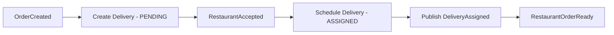
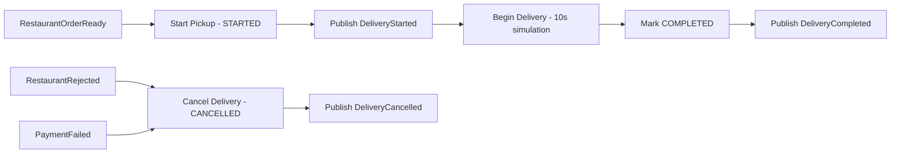

# Delivery Service

## Delivery Service API

**Base URL:**

```
https://{your-host}/health
```

---

### Health Check Endpoints

#### 1. Liveness Probe

```http
GET /health/live
```

Checks if the application process is running.

**Response**

- `200 OK`

  ```json
  {
    "status": "UP"
  }
  ```

---

#### 2. Readiness Probe

```http
GET /health/ready
```

Checks if the service is ready to handle requests (MongoDB and RabbitMQ connections).

**Responses**

- `200 OK` – Service is ready

  ```json
  {
    "status": "UP",
    "mongodb": "CONNECTED",
    "rabbitmq": "CONNECTED"
  }
  ```

- `503 Service Unavailable` – Service dependencies are not ready

  ```json
  {
    "status": "DOWN",
    "mongodb": "DISCONNECTED",
    "rabbitmq": "CONNECTED"
  }
  ```

---

## Event-Driven Architecture

The Delivery Service operates as an event-driven microservice that listens to events from other services and publishes its own events.

### Events Consumed

| Event Type             | Source             | Trigger                   |
| ---------------------- | ------------------ | ------------------------- |
| `OrderCreated`         | Order Service      | New order placed          |
| `RestaurantAccepted`   | Restaurant Service | Restaurant accepts order  |
| `RestaurantOrderReady` | Restaurant Service | Order ready for pickup    |
| `RestaurantRejected`   | Restaurant Service | Restaurant rejects order  |
| `PaymentFailed`        | Payment Service    | Payment processing failed |

### Events Published

| Event Type          | Trigger                  | Description                       |
| ------------------- | ------------------------ | --------------------------------- |
| `DeliveryAssigned`  | Driver assigned to order | Delivery has been scheduled       |
| `DeliveryStarted`   | Driver picks up order    | Delivery is in progress           |
| `DeliveryCompleted` | Order delivered          | Delivery successful               |
| `DeliveryCancelled` | Order cancelled          | Delivery cancelled due to failure |

---

## Delivery Workflow





---

## Delivery Status States

| Status      | Description                                            |
| ----------- | ------------------------------------------------------ |
| `Pending`   | Delivery created, waiting for restaurant acceptance    |
| `Assigned`  | Driver assigned, delivery scheduled                    |
| `Started`   | Driver has picked up the order                         |
| `Completed` | Order successfully delivered                           |
| `Cancelled` | Delivery cancelled due to rejection or payment failure |

---

## Environment Configuration

### Required Environment Variables

| Variable            | Description               | Example                   |
| ------------------- | ------------------------- | ------------------------- |
| `MONGODB_URI`       | MongoDB connection string | `mongodb://mongodb:27017` |
| `MONGODB_DB_NAME`   | Database name             | `delivery-service`        |
| `MONGODB_USER`      | Database username         | `root`                    |
| `MONGODB_PASSWORD`  | Database password         | `admin`                   |
| `RABBITMQ_URI`      | RabbitMQ hostname         | `rabbitmq`                |
| `RABBITMQ_USER`     | RabbitMQ username         | `admin`                   |
| `RABBITMQ_PASSWORD` | RabbitMQ password         | `admin`                   |

## Data Models

### Delivery Document

```typescript
interface IDelivery {
  orderId: string; // Unique order identifier
  correlationId: string; // Request correlation ID
  customerAddress?: string; // Delivery address
  driverId?: string; // Assigned driver ID
  status: DeliveryStatus; // Current delivery status
  assignedAt?: Date; // When driver was assigned
  etaMinutes?: number; // Estimated delivery time
  scheduledAt?: Date; // When delivery was scheduled
  pickedUpAt?: Date; // When order was picked up
  deliveredAt?: Date; // When order was delivered
  createdAt: Date; // Document creation time
  updatedAt: Date; // Last update time
}
```

---

## RabbitMQ Configuration

### Exchanges

- **events.topic** - Topic exchange for all events

### Queues

- **delivery-queue** - Main consumption queue
- **delivery-retry-queue** - Retry queue with 30s TTL
- **delivery-dlq-queue** - Dead letter queue for failed messages

### Routing Keys

#### Consumed Events

- `order.created` - New orders
- `restaurant.accepted` - Restaurant accepts order
- `restaurant.order_ready` - Order ready for pickup
- `restaurant.rejected` - Restaurant rejects order
- `payment.failed` - Payment processing failed

#### Published Events

- `delivery.assigned` - Driver assigned
- `delivery.started` - Delivery started
- `delivery.completed` - Delivery completed
- `delivery.cancelled` - Delivery cancelled

---

## Observability

### Logging

- **Structured logging** with Pino
- **Correlation ID tracking** through async context
- **Pretty printing** in development mode
- **JSON format** in production

### Monitoring

- **OpenTelemetry** auto-instrumentation
- **Health check endpoints** for Kubernetes probes
- **Connection monitoring** for MongoDB and RabbitMQ

### Error Handling

- **Retry logic** with exponential backoff (max 3 attempts)
- **Dead letter queue** for failed messages
- **Idempotent operations** to handle duplicates
- **Graceful degradation** on dependency failures

---

## Development

### Local Development Setup

1. **Install dependencies**

   ```bash
   npm install
   ```

2. **Set up environment**

   ```bash
   cp .env.example .env
   # Edit .env with your local configuration
   ```

3. **Start dependencies (MongoDB + RabbitMQ)**

   ```bash
   docker-compose up -d mongodb rabbitmq
   ```

4. **Run in development mode**
   ```bash
   npm run dev
   ```

### Testing

```bash
# Run all tests
npm test

# Run tests with coverage
npm run test:coverage

# Run in watch mode
npm run test:watch
```

### Building

```bash
# Compile TypeScript
npm run build

# Start production build
npm start
```

---

## GitLab CI/CD Pipeline

### Pipeline Overview

This project uses a GitLab CI/CD pipeline with the following stages:

#### build

- Compiles the TypeScript project
- Runs unit tests with coverage
- Triggered on every push (but not on tag-only pushes)

#### build-image

- Builds and pushes a Docker image to the GitLab Container Registry
- Uses multi-stage Dockerfile for optimized production image
- Triggered **only on Git tag pushes** (e.g. `v1.0.0`)

#### deployment

- Updates the deployment.yaml in the GitOps repository with the new Docker image tag
- Triggers ArgoCD to deploy the updated image to the cluster
- Triggered **only on Git tag pushes** (e.g. `v1.0.0`)

### Creating a Git Tag

To trigger the `build-image` and `deployment` stages, create and push a Git tag:

```bash
git tag v1.0.0
git push origin v1.0.0
```

### Docker Configuration

The service uses a multi-stage Dockerfile:

- **Build stage**: Compiles TypeScript with all dependencies
- **Production stage**: Runs with minimal Node.js 22-slim image
- **Security**: Runs as non-root user (restricted-user:1001)
- **Health**: Exposes port 3000 for health checks

### GitOps Integration

The pipeline automatically updates the GitOps repository:

- **Repository**: `swwao/f2025/exams-projects/Group-7/gitops`
- **Path**: `base/services/delivery-service/deployment.yaml`
- **Update**: Container image tag to match Git tag

---

## Production Deployment

### Kubernetes Configuration

The service is deployed with:

- **Liveness probe**: `/health/live`
- **Readiness probe**: `/health/ready`
- **Resource limits**: Defined in deployment.yaml
- **Environment variables**: Injected via ConfigMap/Secrets

### Monitoring

- **Health endpoints** for Kubernetes monitoring
- **OpenTelemetry traces** exported to console (configurable)
- **Structured logs** for centralized logging
- **Correlation ID tracking** for request tracing
