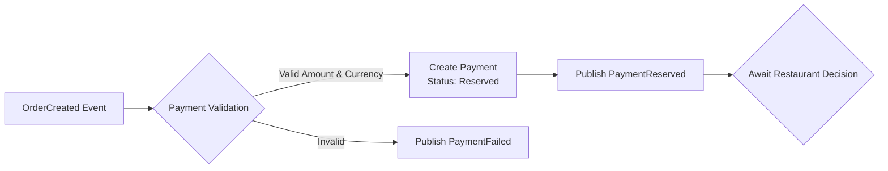
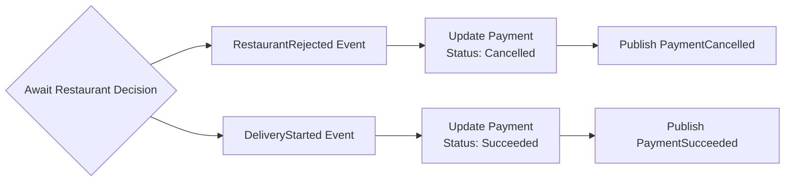

# PaymentService

## Architecture

The PaymentService is an **event-driven microservice** that handles payment processing through RabbitMQ messaging. It operates primarily through asynchronous event handling.

**Base URL:**

```
https://{your-host}/api/orders
```
---

### Key Components

- **Event-Driven Processing**: Listens to order events and publishes payment events
- **Database**: SQL Server with Entity Framework Core
- **Messaging**: RabbitMQ for event publishing and consuming
- **Health Checks**: Kubernetes-ready liveness and readiness probes
- **Security**: Runs as non-root user (`restricted-user`)

---

## Payment Flow





---

## Event Processing

### Consumed Events

The PaymentService listens to these RabbitMQ events:

#### 1. **OrderCreated Event**
```json
{
  "orderId": "3fa85f64-5717-4562-b3fc-2c963f66afa6",
  "customerAddress": "Ryesgade 34, Aarhus C",
  "totalPrice": 37.50,
  "currency": "USD",
  "items": [
    {
      "itemId": "b1a7f15e-1234-4c2a-9fbd-2fae6f8d1234",
      "productName": "Classic Margherita",
      "quantity": 2,
      "price": 12.50
    }
  ]
}
```
**Action**: Creates a payment reservation with status `Reserved`

#### 2. **RestaurantRejected Event**
```json
{
  "orderId": "3fa85f64-5717-4562-b3fc-2c963f66afa6",
  "reason": "Item not available"
}
```
**Action**: Cancels the payment reservation with status `Cancelled`

#### 3. **DeliveryStarted Event**
```json
{
  "orderId": "3fa85f64-5717-4562-b3fc-2c963f66afa6",
  "startedAt": "2025-05-25T14:30:00Z"
}
```
**Action**: Finalizes the payment with status `Succeeded`

### Published Events

The PaymentService publishes these events to RabbitMQ:

#### 1. **PaymentReserved Event**
```json
{
  "orderId": "3fa85f64-5717-4562-b3fc-2c963f66afa6"
}
```

#### 2. **PaymentFailed Event**
```json
{
  "orderId": "3fa85f64-5717-4562-b3fc-2c963f66afa6",
  "reason": "Invalid payment amount"
}
```

#### 3. **PaymentSucceeded Event**
```json
{
  "orderId": "3fa85f64-5717-4562-b3fc-2c963f66afa6"
}
```

#### 4. **PaymentCancelled Event**
```json
{
  "orderId": "3fa85f64-5717-4562-b3fc-2c963f66afa6",
  "reason": "Restaurant rejected order: Item not available"
}
```

---

## HTTP Endpoints

### Health Check

```http
GET /api/payment/health
```

**Response**
```json
{
  "status": "Payment service is running",
  "timestamp": "2025-05-25T14:30:00Z"
}
```

### Kubernetes Health Checks

```http
GET /health/live    # Liveness probe
GET /health/ready   # Readiness probe
```

---

### Payment Statuses

| Status     | Description                           |
|------------|---------------------------------------|
| `Reserved` | Payment amount reserved for the order |
| `Failed`   | Payment processing failed             |
| `Succeeded`| Payment completed successfully        |
| `Cancelled`| Payment cancelled due to order issues |

---

### Docker

**Build image**:
```bash
cd PaymentService
docker build -t payment-service:latest .
```

---

# GitLab CI/CD Pipeline

## Pipeline Overview

This project uses a GitLab CI/CD pipeline with the following stages:

### build
- Compiles the `PaymentService` project
- Runs `dotnet restore` and `dotnet build`
- Triggered on every push (but not on tag-only pushes)

### build-image
- Builds and pushes a Docker image to the GitLab Container Registry
- Uses multi-stage Docker build with security best practices
- Triggered **only on Git tag pushes** (e.g. `v1.0.0`)

### deployment
- Updates the deployment.yaml in the GitOps repository with the new Docker image tag
- Triggers ArgoCD to deploy the updated image to the Kubernetes cluster
- Creates GitOps directory structure if it doesn't exist
- Triggered **only on Git tag pushes** (e.g. `v1.0.0`)

## Creating a Git Tag

To trigger the `build-image` and `deployment` stages, create and push a Git tag:

```bash
git tag v1.0.0
git push origin v1.0.0
```

## Docker Image Features

- **Multi-stage build** (smaller final image ~180MB)
- **Non-root user** (`restricted-user` UID 1001)
- **Security optimizations** (minimal attack surface)
- **Production-ready** (.NET 8 optimized build)
- **Health checks** (Kubernetes integration)
- **Layer caching** (faster CI/CD builds)

---

## Monitoring & Observability

### Structured Logging

The service uses **Serilog** for structured logging with:
- Correlation ID tracking
- Request/response logging
- Health check filtering
- Console output with timestamps

### Health Checks

- **Liveness**: `/health/live` - Basic application health
- **Readiness**: `/health/ready` - Database and RabbitMQ connectivity
- **Custom**: `/api/payment/health` - Service-specific status

### Metrics

The service automatically tracks:
- Payment processing events
- Message consumption rates
- Database connection health
- RabbitMQ connection status

---

## Database Schema

### Payments Table

| Column | Type | Description |
|--------|------|-------------|
| `Id` | uniqueidentifier | Primary key |
| `CorrelationId` | uniqueidentifier | Event correlation ID |
| `OrderId` | uniqueidentifier | Associated order ID |
| `Amount` | decimal(18,2) | Payment amount |
| `Currency` | nvarchar(3) | Currency code (USD, EUR, etc.) |
| `Status` | nvarchar(max) | Payment status enum |
| `CreatedAt` | datetime2 | Creation timestamp |
| `LastUpdated` | datetime2 | Last modification timestamp |
