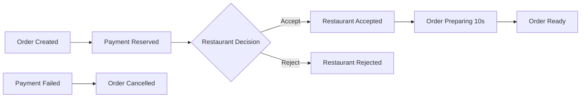

# Restaurant Service

## Restaurant Service API

An event-driven microservice that handles restaurant orders through messaging and saga patterns.

**Base URL:**

```
https://{your-host}
```

---

## Architecture

### Event-Driven Design
Restaurant Service is an event-driven microservice that communicates via RabbitMQ and implements saga patterns for distributed transactions.

### Technology Stack
- **Node.js 22** with **TypeScript**
- **Express 5.1.0** as web framework
- **MongoDB** via **Mongoose 8.14.2** 
- **RabbitMQ** via **amqplib** for messaging
- **OpenTelemetry** for observability/tracing
- **Pino** for structured logging
- **Zod** for schema validation

### Business Flow


    

---

## Event Handling

### Consumed Events

| Event Type | Routing Key | Description |
|------------|-------------|-------------|
| `OrderCreated` | `order.created` | Saves new order to restaurant database |
| `PaymentReserved` | `payment.reserved` | Decides accept/reject (75% acceptance rate) |
| `PaymentFailed` | `payment.failed` | Cancels order |

### Published Events

| Event Type | Routing Key | Description |
|------------|-------------|-------------|
| `RestaurantAccepted` | `restaurant.accepted` | Restaurant accepts order |
| `RestaurantRejected` | `restaurant.rejected` | Restaurant rejects order |
| `RestaurantOrderReady` | `restaurant.order_ready` | Order is ready for pickup |
| `RestaurantCancelled` | `restaurant.cancelled` | Restaurant cancels order |

---

## API Endpoints

### 1. Health Check - Liveness

```http
GET /health/live
```

**Response**
* `200 OK` - Service is alive
  ```text
  OK
  ```

---

### 2. Health Check - Readiness

```http
GET /health/ready
```

Checks connection to MongoDB and RabbitMQ.

**Responses**

* `200 OK` - Service is ready
  ```json
  {
    "status": "UP",
    "mongodb": "CONNECTED",
    "rabbitmq": "CONNECTED"
  }
  ```

* `503 Service Unavailable` - Service not ready
  ```json
  {
    "status": "DOWN", 
    "mongodb": "DISCONNECTED",
    "rabbitmq": "CONNECTED"
  }
  ```

---

### 3. Service Status

```http
GET /
```

**Response**
* `200 OK`
  ```text
  The API is running
  ```

---

## Data Models

### Order Model

```typescript
interface IOrder {
  OrderId: string;           // UUID from original order
  OrderStatus: OrderStatus;  // Pending | Accepted | Rejected | Cancelled | Ready
  EstimatedPrepTime: number; // Minutes
  CreateTime: Date;
  LastUpdated: Date;
  CorrelationId: string;     // For tracing
  OrderItems: ObjectId[];    // References to OrderItem
}
```

### OrderItem Model

```typescript
interface IOrderItem {
  ItemId: string;       // UUID
  OrderId: string;      // Reference to Order
  ProductName: string;  // Product name
  Quantity: number;     // Quantity
  Price: number;        // Price per unit
}
```

### Order Status Enum

```typescript
enum OrderStatus {
  Pending = 'Pending',      // Awaiting processing
  Accepted = 'Accepted',    // Accepted by restaurant
  Rejected = 'Rejected',    // Rejected by restaurant  
  Cancelled = 'Cancelled',  // Cancelled
  Ready = 'Ready',          // Ready for pickup
  Completed = 'Completed'   // Completed
}
```

---

## Configuration

### Environment Variables

```bash
# Database
MONGODB_URI=mongodb://localhost:27017/restaurantdb

# Messaging
RABBITMQ_URI=amqp://localhost:5672

# Logging
LOG_LEVEL=debug
LOG_PRETTY=true

# Application
NODE_ENV=development
PORT=3000
```


## Deployment

### Docker

The service is containerized with multi-stage Docker build:

```dockerfile
# Security-focused with non-root user
FROM node:22-slim AS base
RUN groupadd -g 1001 restricted-group && \
    useradd -r -u 1001 -g restricted-group restricted-user
```

### Local Development

```bash
# Install dependencies
npm install

# Build TypeScript
npm run build

# Start service
npm run start

# Development mode
npm run dev
```

---

## Observability

### Logging
- **Structured logging** with Pino
- **Correlation IDs** throughout entire request flow
- **Context propagation** via AsyncLocalStorage

### Tracing
- **OpenTelemetry** instrumentation
- **Auto-instrumentation** for Express, MongoDB, RabbitMQ
- **Console exporters** for development

### Health Monitoring
- **Liveness probe**: `/health/live`
- **Readiness probe**: `/health/ready`
- **Database connectivity** monitoring
- **Message broker connectivity** monitoring

---

## GitLab CI/CD Pipeline

### Pipeline Overview

This project uses a GitLab CI/CD pipeline with the following stages:

#### build
- Compiles TypeScript code
- Triggered on all pushes (except tag-only pushes)

#### build-image  
- Builds and pushes Docker image to GitLab Container Registry
- Triggered **only on Git tag pushes** (e.g. `v1.0.0`)

#### deployment
- Updates deployment.yaml in GitOps repository with new Docker image tag
- Triggers ArgoCD to deploy updated image to cluster
- Triggered **only on Git tag pushes** (e.g. `v1.0.0`)

### Creating a Git Tag

To trigger the `build-image` stage, create and push a Git tag:

```bash
git tag v1.0.0
git push origin v1.0.0
```

---

## Resilience Patterns

### Message Handling
- **Retry logic** with exponential backoff
- **Dead Letter Queue** pattern for poison messages
- **At-least-once delivery** guarantees
- **Circuit breaker** for RabbitMQ connections

### Error Handling
- **Graceful degradation** on service failures
- **Correlation ID** tracking for debugging
- **Structured error logging** with context

### Publisher Reliability
- **Confirm channels** for reliable publishing
- **Mandatory flag** for unroutable message detection
- **Automatic retry** with backoff
- **DLQ fallback** for permanent failures


